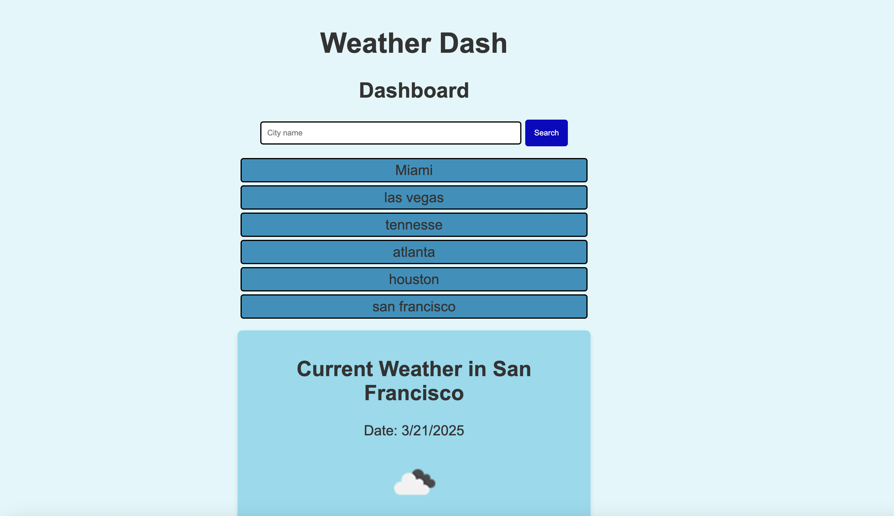
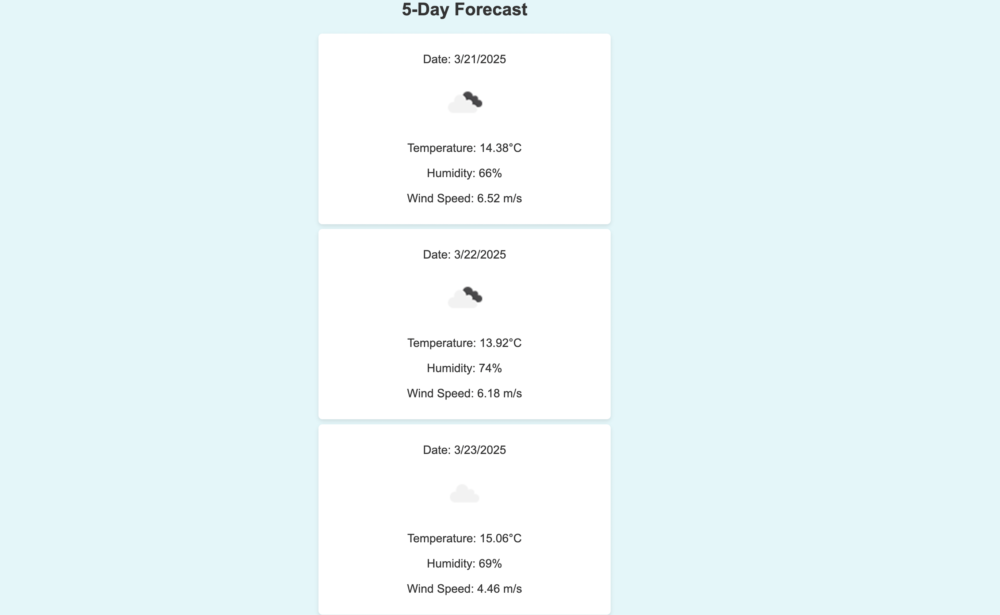

# WeatherDash

## Weather Dashboard Requirements

### User Story
As a user, I want to search for a city and view its current and future weather conditions so that I can plan my activities accordingly.

### Acceptance Criteria

1. **Search Functionality**
   - GIVEN a weather dashboard with form inputs
   - WHEN I search for a city
   - THEN I am presented with current and future conditions for that city, and that city is added to the search history

2. **Current Weather Display**
   - GIVEN a city is selected (via search or history)
   - WHEN I view current weather conditions for that city
   - THEN I am presented with:
     - City name
     - The current date
     - An icon representation of weather conditions
     - The temperature
     - The humidity
     - The wind speed

3. **Future Weather Forecast**
   - GIVEN a city is selected
   - WHEN I view future weather conditions for that city
   - THEN I am presented with a 5-day forecast that includes:
     - The date
     - An icon representation of weather conditions
     - The temperature
     - The wind speed
     - The humidity

4. **Search History**
   - GIVEN a city has been previously searched
   - WHEN I click on a city in the search history
   - THEN I am again presented with current and future conditions for that city

### Additional Considerations
- The weather data should be fetched from a reliable weather API.
- The user interface should be responsive and user-friendly.
- Search history should persist (e.g., using local storage).
- Errors or invalid city entries should be gracefully handled with an appropriate message.
